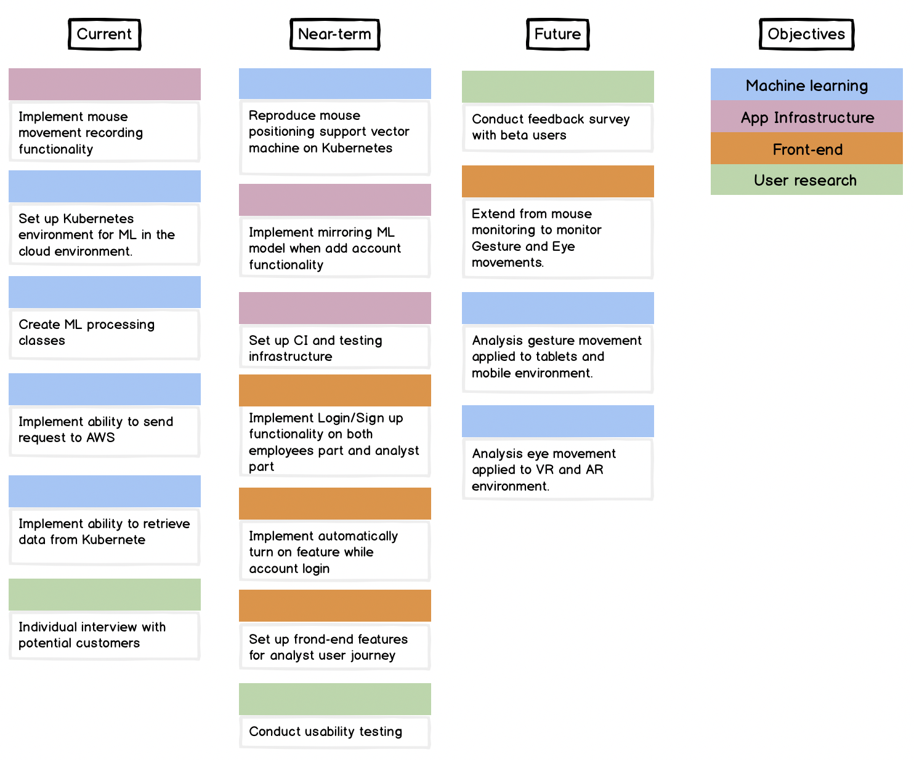

# Roadmap
For our MVP, we will be focusing on creating behavior biometric services on Amazon Web Services. Therefore, our product roadmap will largely be influenced by Amazon Web Services. Based on our product features, the process is as follows:

1. We must first deploy our website on AWS Amplify, Amazon DynamoDB, and AWS Lambda.
2. The next step is to build the ML model for mouse movement behavior biometric detection with AWS Lambda and setup monitorization feature for mouse movement by HTML and JavaScript.
3. Our services can extend from mouse movement to gesture and eye movements for Tablet and VR environments.

## Short Term

**Duration:** rom September 2020 to November 2020

We intend to deploy our website on AWS Amplify, Amazon DynamoDB, and AWS Lambda.

## Medium Term

**Duration:** from November 2020 to December 2020

We intend to build the ML model for mouse movement behavior biometric detection with AWS Lambda and setup monitorization feature for mouse movement by HTML and JavaScrip.

We plan to launch a barebones alpha version in the medium term.

## Long Term

**Duration:** from December 2020 to future

We intend to extend from mouse movement to gesture and eye movements for Tablet and VR environments.

