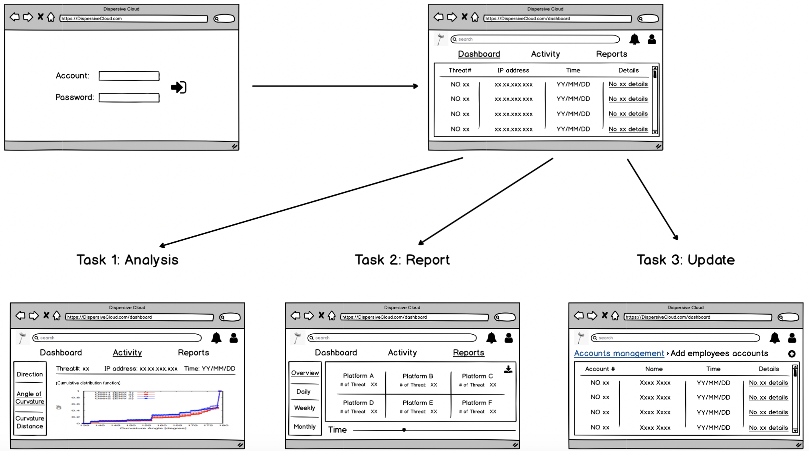

# User Validation

## Problem & Solution
The problem we are trying to solve is the problem of account leak with low detection rate in the cloud environment, and catch the opportunity of the SIEM cloud trend.

Our solution aims to to increase detection rate of account leak in the cloud environment with a simple and light serverless behavioural biometrics user verification system.

## Mockup
We built our low fidelity prototype for user research using Balsamiq.

## User Research

### Find suitable set of test users

Based on the professional property of our target user tier1 analyst, we can effectively obtain feedback from target users through our partners RBC and LinkedIn. At the same time, because of the scarcity of target users, the number of users we can interview is very limited.

#### Overview of people interviewed

### Mr. C
## Background
a RBC Data Science Team Sr Manager
## Matched channel
RBC partnership

### Mr. R
## Background
a Tier 1 Security analyst
## Matched channel
LinkedIn

### Conduct usability testing on the set of test users
The process of our user usability test is:
	1. Inform participants that the testing process will be recorded throughout
	2. Remind participants to think aloud every step of the way during the participation process
	3. Give participants a list of tasks to complete the low-fidelity prototype of Dispersive Cloud
	4. Record participants' performance and feedback during task execution
	5. Finish the test through a series of general feedback questions

#### A list of tasks 

This is our task list based on our product features:

##### Scenario 1: Analyze threat
Imagine you are a tier 1 analyst and now you have received a threat warning. Please find the threat through our low-fidelity prototype and analyze it.

##### Scenario 2: Report generation
Imagine you are a tier 1 analyst. It is the end of the month and you need to produce a work report for your work this month. Please get the information you need through our low-fidelity prototype.

##### Scenario 3: Update new users
Imagine that you are a tier 1 analyst and a new colleague has arrived in your company. Please add the new colleague’s account to the monitoring system through our low-fidelity prototype.

To view our research notes, please refer to our [user research raw note](https://docs.google.com/document/d/1iXP6XdHXkcL83kZMgt4p6bWCZz-a3eEGzfGHOZeBLS8/edit?usp=sharing).

## Research Thoughts
Participants in our usability test have completed tasks smoothly and left very constructive feedback.

### Analyzing threats features
- Overview needs to have read/unread categories
- Analyzing the chart needs to clearly distinguish between normal users and abnormal users

### Report generation features
- Report display of all historical data
- To be able to select multiple, single-select threat platform summary report
- To identify real alert and false alert in the record

### Update employee account features
- Need to have a clear chart in the main interface
- The reliability of building the model after 10 operations is low, and 100 operations (the number of operations in a working day) can be used to build a user model profile
-Corresponding prompt after successful addition

## Build Plan
We have updated our roadmap based on the feedback we received from the user testing.

